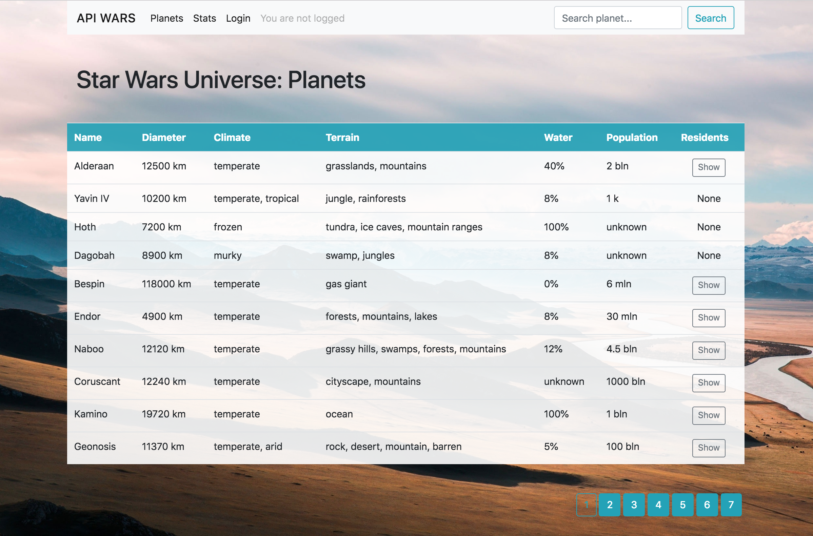
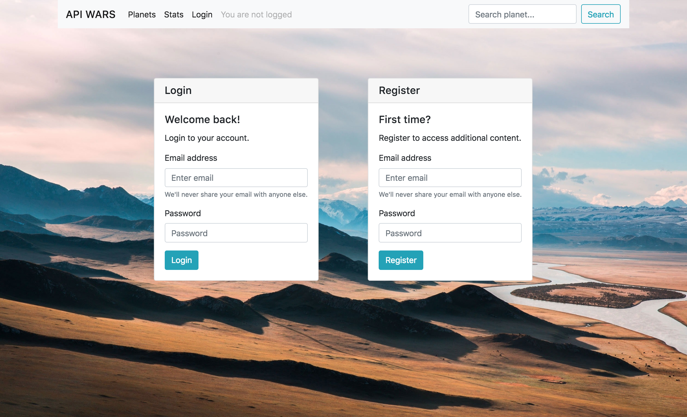

# API Wars (Codecool Project)

## About project

This is a small web application which shows data about the Star Wars universe, store visitor preferences in DB and handle user login with sessions.

## How to run
Install all dependencies with `yarn install` and run the server `yarn start`.

## Dependencies

This project require:
- bcrypt-nodejs
- body-parser
- ejs
- express
- express-session
- mongodb
- node-fetch
- nodemon

## Screenshots

